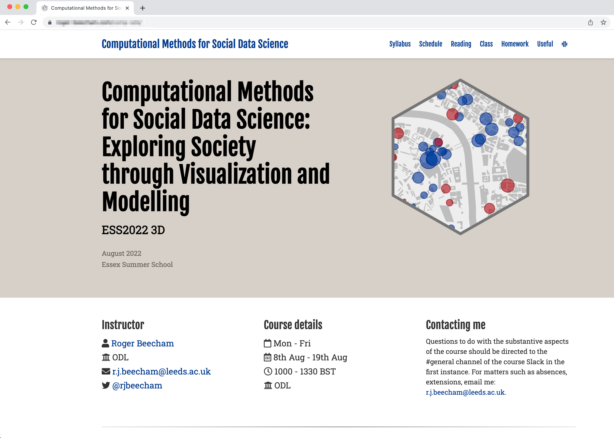

```{r setup, include=FALSE, echo=FALSE}
options(htmltools.dir.version = FALSE)
knitr::opts_chunk$set(comment = "")
library(tidyverse)
library(here)
library(knitr)
library(kableExtra)
```

???

1. Quick introduction to course -- how it will be configured and working -- split of theoretical and lab activity.
2. Introduce rationale behind the course, my ambition with it.
3. "Engagement" / lab acticity -- instead establish understanding  / ambition with course

---

## Course Overview

--
.tiny-font[
> In modern data analysis, **graphics** and **computational statistics** are increasingly used together to explore and **identify complex patterns** in data and to make and **communicate claims under uncertainty**. This course will go beyond traditional ideas of charts, graphs, maps (and also statistics!) to equip you with the **analysis**, **design** and **technical skills** to analyse and communicate with social science datasets.
]

???

So : this course is about demonstrating a "modern" approach to data analysis (with social science datasets)
--
.tiny-font[
> The course emphasises real-world applications. You will work with both new, **large-scale behavioural datasets**, as well as more traditional, **administrative datasets** located within various social science domains: Political Science, Crime Science, Urban and Transport Planning.
]

???

There are loads of excellent how-to primers...
--
.tiny-font[
> As well as learning how to use graphics and statistics to explore patterns in these data, implementing recent ideas from **data journalism** you will learn how to communicate research findings – how to tell stories with data.
]

???
**Journalism** Data science is very application oriented. Some of the more substantive analyses I've seen recently haven't necessarily come from academia.

---


## Course Objectives

.tiny-font[
By the end of the course you will:
]

--
.tiny-font[
*	**Describe, process and combine** social science datasets from a range of sources.
]

--
.tiny-font[
*	**Design statistical graphics** that expose structure in social science data and that are underpinned by established principles in information visualization and cartography.
]
--
.tiny-font[
*	Use modern data science and visualization frameworks to produce **coherent, reproducible data analyses**.
]
--
.tiny-font[
*	Apply modern statistical techniques for analysing, **representing and communicating data and model uncertainty**.
]


???

Want to cover main components of modern data analysis -- they are here.

But to do so by stealth : through real analysis scenarios.

---

## Course Website


</img>


???

Schedule > Explain and justify each session.
Session 08 > Identify Conceptual versus Technical.

---


## Course Schedule


</img>


???

Conceptual and Technical elements
Examples revealing some of the sessions

Flexibility:
* We can do this/configure these sessions however we want.
* Material and explanation is down on these web-pages.
* BUT we have 3 hours of contact time.
* MY PLAN: Lecture for 40 mins with questions.  Then lab activity where can do one-to-one coding and I interrupt noq and again.


---


class: center middle

## Session 1: Computational Methods for Social Data Science

---

<!-- ## Conceptual Element

.small-font[
1. Why computational data analysis?

2. Why (and how) `R` and `ggplot2`
]


--- -->

## Why *comp-sds*?

--

.small-font[
**"big data"** and **"data science"** on Google Trends, Oct 2019
]
</img>

???

Google Trends

From 2010s -- big data

Later : Data Science Calling upon new ways of doing science

---

## Why *comp-sds*?

.small-font[
* 1000 years ago -- **experimental science**
	+ Description of natural phenomena

* 100s years ago -- **theoretical science**
	+ Newton’s laws, Maxwell’s Equations

* <50 years ago -- **computational science**
	+ Simulate complex phenomena

* Today -- **data-intensive science**
  + Generate knowledge through 	observation
]


</img>


???

Tony Hey (2009) -- essays on data science -- first to discuss way data is bringing a paradigm shift in scientific process :

* Experimental science :  all we could know about was what we observed directly
* Theory : abstracting above observations to generate fundamental laws about how things are
* Sumulation : Test theories by simulating real world
* Today : Back observation, but derive knowledge in new ways: we don't need to simulate the world to test things.
---


## Why *comp-sds*?

.small-font[
Donoho 2017's six key facets that a data science discipline might encompass:

1.  data gathering, preparation, and exploration;

2.  data representation and transformation;

3.  computing with data;

4.  data visualization and presentation;

5.  data modelling;

6.  and a more introspective “science about data science”
]

<br>

.tiny-font[
Donoho, D. 2017. “50 Years of Data Science”, *Journal of Computational and Graphical Statistics*, 26 (6): 745–66. doi: [10.1080/10618600.2017.1384734](https://www.tandfonline.com/doi/full/10.1080/10618600.2017.1384734)
]

???

---


## Why *comp-sds*?

.small-font[
Donoho 2017's six key facets that a data science discipline might encompass:

1.  **data gathering, preparation, and exploration (Sessions 2, 3, 5)**;

2.  .grey[data representation and transformation;]

3.  .grey[computing with data;]

4.  .grey[data visualization and presentation;]

5.  .grey[data modelling;]

6.  .grey[and a more introspective “science about data science”]
]
<br>

.tiny-font[
Donoho, D. 2017. “50 Years of Data Science”, *Journal of Computational and Graphical Statistics*, 26 (6): 745–66. doi: [10.1080/10618600.2017.1384734](https://www.tandfonline.com/doi/full/10.1080/10618600.2017.1384734)
]
---

## Why *comp-sds*?

.small-font[
Donoho 2017's six key facets that a data science discipline might encompass:

1.  .grey[data gathering, preparation, and exploration;]

2.  **data representation and transformation (Sessions 2, 3)**;

3.  .grey[computing with data;]

4.  .grey[data visualization and presentation;]

5.  .grey[data modelling;]

6. .grey[ and a more introspective “science about data science”]
]
<br>

.tiny-font[
Donoho, D. 2017. “50 Years of Data Science”, *Journal of Computational and Graphical Statistics*, 26 (6): 745–66. doi: [10.1080/10618600.2017.1384734](https://www.tandfonline.com/doi/full/10.1080/10618600.2017.1384734)
]
---

## Why *comp-sds*?

.small-font[
Donoho 2017's six key facets that a data science discipline might encompass:

1.  .grey[data gathering, preparation, and exploration;]

2.  .grey[data representation and transformation;]

3.  **computing with data (Session 2, All sessions)**;

4.  .grey[data visualization and presentation;]

5.  .grey[data modelling;]

6.  .grey[and a more introspective “science about data science”]
]
<br>

.tiny-font[
Donoho, D. 2017. “50 Years of Data Science”, *Journal of Computational and Graphical Statistics*, 26 (6): 745–66. doi: [10.1080/10618600.2017.1384734](https://www.tandfonline.com/doi/full/10.1080/10618600.2017.1384734)
]
---


## Why *comp-sds*?

.small-font[
Donoho 2017's six key facets that a data science discipline might encompass:

1.  .grey[data gathering, preparation, and exploration;]

2.  .grey[data representation and transformation;]

3. .grey[computing with data;]

4.  .grey[data visualization and presentation;]

5.  **data modelling (Sessions 4, 6, 7, 8)**;

6.  **and a more introspective “science about data science” (All sessions)**
]
<br>

.tiny-font[
Donoho, D. 2017. “50 Years of Data Science”, *Journal of Computational and Graphical Statistics*, 26 (6): 745–66. doi: [10.1080/10618600.2017.1384734](https://www.tandfonline.com/doi/full/10.1080/10618600.2017.1384734)
]
---

## Why *comp-sds*?

.small-font[
Donoho 2017's six key facets that a data science discipline might encompass:

1.  .grey[data gathering, preparation, and exploration;]

2.  .grey[data representation and transformation;]

3. .grey[computing with data;]

4.  .red[**data visualization and presentation (All sessions)**;]

5.  .grey[data modelling;]

6.  .grey[and a more introspective “science about data science”]
]

<br>

.tiny-font[
Donoho, D. 2017. “50 Years of Data Science”, *Journal of Computational and Graphical Statistics*, 26 (6): 745–66. doi: [10.1080/10618600.2017.1384734](https://www.tandfonline.com/doi/full/10.1080/10618600.2017.1384734)
]

???

Want to make a special case for the use for visualization techniques for social data science.
---

## Why *comp-sds*?


</img>

???

Canonical example

---

## Why *comp-sds*?

</img>

---

## Why *comp-sds*?

<a href="https://www.autodesk.com/research/publications/same-stats-different-graphs">
 </img>
</a>


<br><br><br><br><br><br><br><br><br>
.small-font[
[`datasaurus`](https://itsalocke.com/datasaurus/) R package
]

---

## Why *comp-sds*?

<div class="embed-responsive embed-responsive-16by9">
<iframe class="embed-responsive-item" src="https://www.youtube.com/embed/FaRBUnO5PZI" frameborder="0" allow="accelerometer; autoplay; encrypted-media; gyroscope; picture-in-picture" allowfullscreen width="60%" height="40%"></iframe>
</div>

---

## Why *comp-sds*?


 </img>

<br><br><br><br><br><br><br><br>
.xtiny-font[
```{r data-excerpt, echo=TRUE, eval=FALSE}
memberID   oTime             dTime              oStation    dStation
217####	   13/12/2012 11:20	 13/12/2012 11:36	  421	        421
217####	   28/10/2012 11:45	 28/10/2012 11:48	  492	        505
217####	   15/12/2012 11:04	 15/12/2012 11:07	  492	        505
217####	   31/12/2012 08:45	 31/12/2012 08:49	  492	        505
217####	   02/01/2013 08:49	 02/01/2013 08:53	  492	        505
217####	   06/01/2013 11:26	 06/01/2013 11:29	  492	        505
217####	   18/01/2013 08:37	 18/01/2013 08:41	  492       	 505
```
]


---

## Why *comp-sds*?


 </img>

--
<br><br><br><br><br><br><br><br>
.tiny-font[`trips per year: c.10 million`]
<br>
--
.tiny-font[`modal day of week: Wed-Thu`]
<br>
--
.tiny-font[`modal month of year: Jun-Jul`]
<br>
--
.tiny-font[`average travel time: 8 mins`]

---

## Why *comp-sds*?


 </img>


---

## Why *comp-sds*?


 </img>


---

## Why *comp-sds*?


 </img>


---

## Why *comp-sds*?


 </img>


---

## Why *comp-sds*?


 </img>


---

## Why *comp-sds*?


 </img>


---


## Why *comp-sds*?

.small-font[
In Social Data Science research projects:]
--
.small-font[
* Data are repurposed for social science research often **for the first time**;]
--
.small-font[
* Contain complex structure and geo-spatial relations that **cannot be easily captured by statistical summaries alone**;]
--
.small-font[
* Types of questions that can be asked and the techniques deployed **cannot be easily specified in advance**
]
---

## Why *comp-sds*?

 </img>

<br><br><br><br><br><br><br><br><br><br><br>

.tiny-font[
Sedlmair, M., Meyer, M., and Munzner, T. (2012) "Design Study Methodology: Reflections from the Trenches and the Stacks," *IEEE Transactions on Visualization and Computer Graphics*, 18(12): 2431-2440, doi: [10.1109/TVCG.2012.213](https://ieeexplore.ieee.org/document/6327248)
]

---

## How *comp-sds*?
--
 </img>

---

## How *comp-sds*?


<a href="https://fivethirtyeight.com/features/science-isnt-broken/">
 </img>
</a>

???

Go to web-page and explain
---

## How *comp-sds*?

.small-font[
> **Reproducible research** is the idea that data analyses, and more generally, scientific claims, are published with their data and software code so that others may verify the findings and build upon them.
>
> Roger Peng, Jeff Leek and Brian Caffo
]

--

<br>
.small-font[
A reproducible research project should be accompanied with code and data that:

* allow all published tables and figures to be regenerated
* does what it claims (the code works)
* can be justified and explained through proper documentation
]
---

## How *comp-sds*?

 </img>

---

## Conclusions

**Why**

.small-font[
In Social Data Science research projects:]

.small-font[
* Data are repurposed for social science research often **for the first time**;]

.small-font[
* Contain complex structure and geo-spatial relations that **cannot be easily captured by statistical summaries alone**;]

.small-font[
* Types of questions that can be asked and the techniques deployed **cannot be easily specified in advance**
]

<br>

**How**

.small-font[
`R`| `RStudio` | `R Markdown` | `tidyverse ++`
]
---


## Technical Element
.small-font[
1. Install the latest versions of `R` and `RStudio`

2. Install and load some packages

3. Experiment with `Rmd`

4. Create an RStudio project
]

???

Templates : key thing folder structure -- share computer

---

## DirectPoll

Link to poll:
```http://etc.ch/z62Q```

---

## Slack

???
1. Grab a coffee
2. Post your favourite graphic
3. We will discuss
