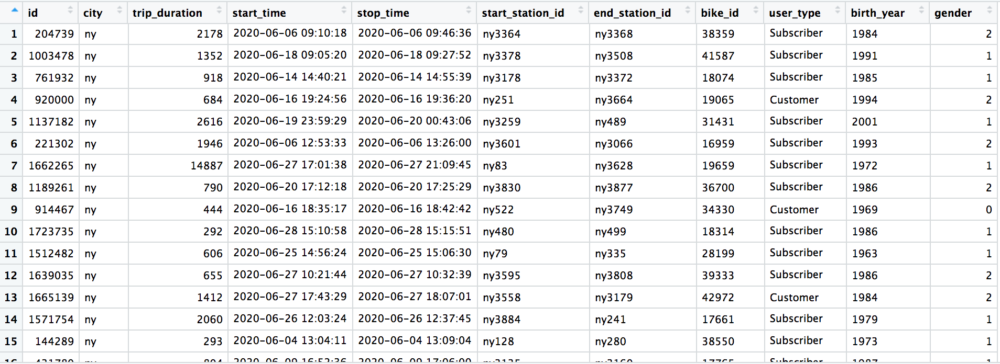
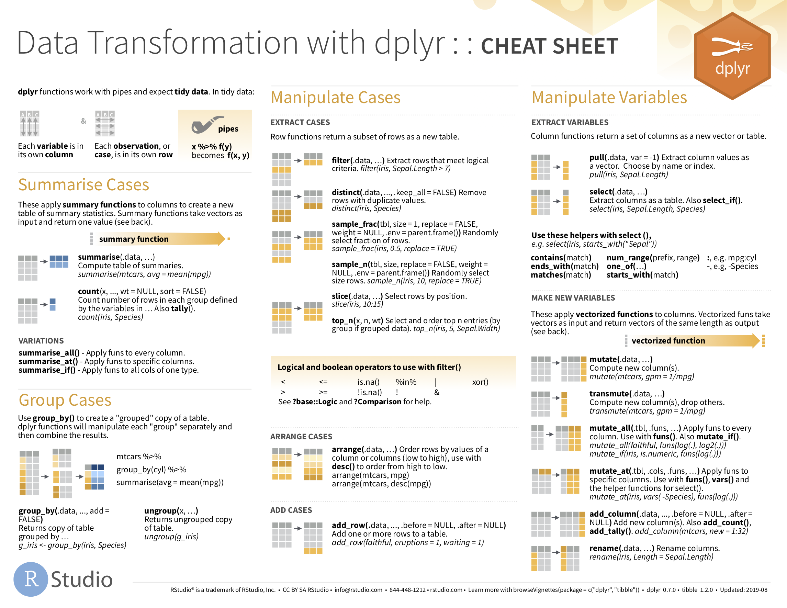

```{r setup, include=FALSE, echo=FALSE}
options(htmltools.dir.version = FALSE)
knitr::opts_chunk$set(comment = "")
library(tidyverse)
library(here)
library(knitr)
library(kableExtra)
```

???
Review objectives --
* vocab important -- determines the operations that we can perform.
* vocab important sds -- new data, work out its structure.
* tidyverse -- end up coming up with analysis templates
* bikedata and citibike -- loading data for the first time; exploring usefulness for cycling research -- show data
* short on conceptual; large on technical


---


## Data structure

#### `data frame` | `tibble`

</img>

???

spreadsheet like representations:
*  rows are observations (case/record)
*  columns are variables
* organising not alwats eady -- Tidy
*  Each variable (column) in a data frame is a vector that must be of equal length
* Missing - `NA`
* `list-col`


---


## Stevens levels of measurement

--

.xtiny-font[
```{r variable-types, echo=FALSE, fig.cap="Breakdown of variable types", out.width="100%"}
variable_types <- tibble::tibble(
  Measurement = c("`Nominal`", "`Ordinal`", "`Quantitative`", "`Temporal`", "`Geospatial`"),
  Description = c(
    "Categories that cannot be ordered",
    "Categories that can be ordered",
    "Numeric measurements and counts",
    "Measures related to time",
    "Geographic locations and features"
  ),
  Example = c(
    "Names of people;  countries; political parties",
    "Small, Medium, Large; 1st, 2nd, 3rd",
    "Distances; prices; temperatures; frequencies",
    "Dates; times",
    "Long/Lat, Easting/Northing; region/country geometries"
    )
)


variable_types <- tibble::tibble(
  Measurement = c("Nominal", "Ordinal", "Interval", "Ratio"),
  Description = c(
    "Non-orderable categories",
    "Orderable categories",
    "Numeric measurements",
    "... &#124 Counts"
  ),
  Example = c(
    "Political parties; street names",
    "Terrorism threat levels",
    "Temperatures; calendar years",
    "Distances; prices "
    ),
  Operators = c(
    "&#61;  &#8800;",
    "... &#124 <>",
    "... &#124 +  -",
    "... &#124 &#215; &#247;"
    ),
    Midpoint = c(
      "mode",
      "... &#124 median",
      "... &#124 mean",
      "... &#124 mean"
      ),
      Dispersion = c(
        "entropy",
        "... &#124 percentile",
        "... &#124 variance",
        "... &#124 variance"
        )

)

kbl(variable_types, protect_latex = TRUE, escape=FALSE) %>%
 pack_rows("Categories", 1, 2, bold=FALSE, label_row_css = "border-bottom: 0px solid;") %>%
 pack_rows("Measures", 3, 4, bold=FALSE, label_row_css = "border-bottom: 0px solid;") %>%
 column_spec(1, width = "8em") %>%
 row_spec(c(0,1,2,3,4), color = "grey")
```
]


???
Stevens's typology  for describing data (Stevens 1946 -- *Science*)

Categories and Measures.

---


## Stevens levels of measurement

.xtiny-font[
```{r variable-types-2, echo=FALSE, fig.cap="Breakdown of variable types", out.width="100%"}
variable_types <- tibble::tibble(
  Measurement = c("`Nominal`", "`Ordinal`", "`Quantitative`", "`Temporal`", "`Geospatial`"),
  Description = c(
    "Categories that cannot be ordered",
    "Categories that can be ordered",
    "Numeric measurements and counts",
    "Measures related to time",
    "Geographic locations and features"
  ),
  Example = c(
    "Names of people;  countries; political parties",
    "Small, Medium, Large; 1st, 2nd, 3rd",
    "Distances; prices; temperatures; frequencies",
    "Dates; times",
    "Long/Lat, Easting/Northing; region/country geometries"
    )
)


variable_types <- tibble::tibble(
  Measurement = c("Nominal", "Ordinal", "Interval", "Ratio"),
  Description = c(
    "Non-orderable categories",
    "Orderable categories",
    "Numeric measurements",
    "... &#124 Counts"
  ),
  Example = c(
    "Political parties; street names",
    "Terrorism threat levels",
    "Temperatures; calendar years",
    "Distances; prices "
    ),
  Operators = c(
    "&#61;  &#8800;",
    "... &#124 <>",
    "... &#124 +  -",
    "... &#124 &#215; &#247;"
    ),
    Midpoint = c(
      "mode",
      "... &#124 median",
      "... &#124 mean",
      "... &#124 mean"
      ),
      Dispersion = c(
        "entropy",
        "... &#124 percentile",
        "... &#124 variance",
        "... &#124 variance"
        )

)

kbl(variable_types, protect_latex = TRUE, escape=FALSE) %>%
 pack_rows("Categories", 1, 2, bold=FALSE, label_row_css = "border-bottom: 0px solid;") %>%
 pack_rows("Measures", 3, 4, bold=FALSE, label_row_css = "border-bottom: 0px solid;") %>%
 column_spec(1, width = "8em") %>%
 row_spec(c(0,3,4), color = "grey")
```
]


---

## Stevens levels of measurement

.xtiny-font[
```{r variable-types-3, echo=FALSE, fig.cap="Breakdown of variable types", out.width="100%"}
variable_types <- tibble::tibble(
  Measurement = c("`Nominal`", "`Ordinal`", "`Quantitative`", "`Temporal`", "`Geospatial`"),
  Description = c(
    "Categories that cannot be ordered",
    "Categories that can be ordered",
    "Numeric measurements and counts",
    "Measures related to time",
    "Geographic locations and features"
  ),
  Example = c(
    "Names of people;  countries; political parties",
    "Small, Medium, Large; 1st, 2nd, 3rd",
    "Distances; prices; temperatures; frequencies",
    "Dates; times",
    "Long/Lat, Easting/Northing; region/country geometries"
    )
)


variable_types <- tibble::tibble(
  Measurement = c("Nominal", "Ordinal", "Interval", "Ratio"),
  Description = c(
    "Non-orderable categories",
    "Orderable categories",
    "Numeric measurements",
    "... &#124 Counts"
  ),
  Example = c(
    "Political parties; street names",
    "Terrorism threat levels",
    "Temperatures; calendar years",
    "Distances; prices "
    ),
  Operators = c(
    "&#61;  &#8800;",
    "... &#124 <>",
    "... &#124 +  -",
    "... &#124 &#215; &#247;"
    ),
    Midpoint = c(
      "mode",
      "... &#124 median",
      "... &#124 mean",
      "... &#124 mean"
      ),
      Dispersion = c(
        "entropy",
        "... &#124 percentile",
        "... &#124 variance",
        "... &#124 variance"
        )

)

kbl(variable_types, protect_latex = TRUE, escape=FALSE) %>%
 pack_rows("Categories", 1, 2, bold=FALSE, label_row_css = "border-bottom: 0px solid;") %>%
 pack_rows("Measures", 3, 4, bold=FALSE, label_row_css = "border-bottom: 0px solid;") %>%
 column_spec(1, width = "8em") %>%
 row_spec(c(0,1,2), color = "grey")
```
]


???

Need to describe data in a consistent way.

---


## Stevens levels of measurement

.xtiny-font[
```{r variable-types-4, echo=FALSE, fig.cap="Breakdown of variable types", out.width="100%"}
variable_types <- tibble::tibble(
  Measurement = c("`Nominal`", "`Ordinal`", "`Quantitative`", "`Temporal`", "`Geospatial`"),
  Description = c(
    "Categories that cannot be ordered",
    "Categories that can be ordered",
    "Numeric measurements and counts",
    "Measures related to time",
    "Geographic locations and features"
  ),
  Example = c(
    "Names of people;  countries; political parties",
    "Small, Medium, Large; 1st, 2nd, 3rd",
    "Distances; prices; temperatures; frequencies",
    "Dates; times",
    "Long/Lat, Easting/Northing; region/country geometries"
    )
)


variable_types <- tibble::tibble(
  Measurement = c("Nominal", "Ordinal", "Interval", "Ratio"),
  Description = c(
    "Non-orderable categories",
    "Orderable categories",
    "Numeric measurements",
    "... &#124 Counts"
  ),
  Example = c(
    "Political parties; street names",
    "Terrorism threat levels",
    "Temperatures; calendar years",
    "Distances; prices "
    ),
  Operators = c(
    "&#61;  &#8800;",
    "... &#124 <>",
    "... &#124 +  -",
    "... &#124 &#215; &#247;"
    ),
    Midpoint = c(
      "mode",
      "... &#124 median",
      "... &#124 mean",
      "... &#124 mean"
      ),
      Dispersion = c(
        "entropy",
        "... &#124 percentile",
        "... &#124 variance",
        "... &#124 variance"
        )

)

kbl(variable_types, protect_latex = TRUE, escape=FALSE) %>%
 pack_rows("Categories", 1, 2, bold=FALSE, label_row_css = "border-bottom: 0px solid;") %>%
 pack_rows("Measures", 3, 4, bold=FALSE, label_row_css = "border-bottom: 0px solid;") %>%
 # column_spec(1, width = "8em") %>%
 column_spec(c(1,2,3), color = "grey")
```
]


???

Constrain operations that can be performed.

---


## Stevens levels of measurement

.tiny-font[Object types in `R`:]

.xtiny-font[
```{r data-types, echo=FALSE, out.width="100%"}

data_types <- tibble::tibble(
  Type = c("lgl", "int", "dbl", "chr", "dttm", "fctr" ),
  Description = c(
    "Logical -- vectors that can contain only `TRUE` or `FALSE` values",
    "Integers -- whole numbers",
    "Double --  real numbers with decimals",
    "Character -- text strings",
    "Date-times -- a date + a time",
    "Factors -- represent categorical variables of fixed and potentially orderable values"
  )
)

kbl(data_types)
```
]

---


## Stevens levels of measurement


.tiny-font[
* dataset: [Citibike OD trip data](https://www.citibikenyc.com/system-data)
* variable: `trip_distance` | `user_type`
* measurement: `ratio` | `nominal`
]

--

.xtiny-font[
```{r plot-dist, echo=FALSE, fig.cap="Histograms generated with ggplot2. Plot data computed using dplyr and lubridate", out.width="70%"}
include_graphics("../class/02-class_files/dist.png", error = FALSE)
```
]
???

So we could also calculate the mean and median for each of these, compare them through subtraction and also division -- how many times greater is trip dist for > versus ?. Also variation.

Notice that `subscriber` and `customer` are variables measured at category level.


---

## Stevens levels of measurement

.tiny-font[
* dataset: Citibike OD trip data
* variable: `trip_speed` | `user_age_band` | `user_sex` | `trip_distance`
* measurement: `ratio` | `ordinal` | `nominal` | `ordinal`
]

--

.xtiny-font[
```{r plot-speeds, echo=FALSE, fig.cap="Line charts generated with ggplot`. Plot data computed using dplyr and lubridate", out.width="65%"}
include_graphics("../class/02-class_files/speeds.png", error = FALSE)
```
]
???

E.g. with data graphics --


---


## Stevens levels of measurement


.tiny-font[
* dataset: Citibike OD trip data
* variable: `trip_count` | `hod` | `user_sex` | `day_week`
* measurement: `ratio` | `interval|cyclic ratio` | `nominal` | `ordinal`
]

--

.xtiny-font[
```{r plot-temporal, echo=FALSE, fig.cap="Line charts generated with ggplot2. Plot data computed using dplyr and lubridate.", out.width="65%"}
include_graphics("../class/02-class_files/hod_dow.png", error = FALSE)
```
]

???
E.g. with data graphics -- for example in this session. Summarise distribution on quantitative variable (time of day). Though this is a cyclic variable so hour of day necessary

---


## Tidy data


???
So that was *describing data*
Next: how to represent/organise data.

---

## Tidy data


</img>

---

## Tidy data

.xtiny-font[
```{r drugs-one, echo=FALSE, fig.cap="Untidy", out.width="50%"}
drugs <- tibble::tibble(
  person = c("John Smith", "Jane Doe", "Mary Johnson"),
  treatment_a = c("--", "16", "3"),
  treatment_b = c("2", "11", "1")
    )
kbl(drugs,  caption = "Untidy")
```
]

???
Every cell can be unambiguously identified

But not tidy -- as treatment class is spread across columns.

Transpose: observations spread across columns.
---
## Tidy data

.xtiny-font[
```{r drugs-two, echo=FALSE, fig.cap="Untidy", out.width="50%"}
drugs <- tibble::tibble(
  treatment = c("treatment_a", "treatment_b"),
  "John Smith" = c("--", "2"),
  "Jane Doe" = c("16", "11"),
  "Mary Johnson" = c("3", "1")
    )
kbl(drugs,  caption = "Untidy")
```
]

<br>
--

.xtiny-font[
```{r drugs-tidy, echo=FALSE, fig.cap="Tidy version of Table 1 of @wickham_tidy_2014", out.width="100%"}
drugs <- tibble::tibble(
  person = c("John Smith", "John Smith", "Jane Doe", "Jane Doe", "Mary Johnson", "Mary Johnson"),
  treatment = c("a", "b", "a", "b", "a", "b"),
  result = c("--", "2", "16", "11", "3", "1")
    )
kbl(drugs,  caption = "Tidy")
```
]

???
identify the **variables** and their **values**:

1. `person`:  a categorical nominal variable which takes three values: John Smith, Jane Doe, Mary Johnson.
2. `treatment`: a categorical nominal variable which takes values: a and b.
3. `result`: a measurement ratio (I think) variable which six recorded values (including the missing value)

Each **observation** is then a test result returned for each combination of `person` and `treatment`.

---

<!-- ## Tidy data

.xtiny-font[
```{r gapminder-untidy1, echo=FALSE, fig.cap="Untidy excerpt of [`gapminder`](https://www.gapminder.org/data/) dataset.", out.width="100%"}
gapminder_untidy1 <- tibble::tibble(
  country = c("Afghanistan", "Afghanistan", "Afghanistan", "Afghanistan",  "Brazil", "Brazil", "..."),
  year = c("1999", "1999", "2000", "2000", "1999", "1999", "..."),
  type = c("cases", "population", "cases", "population", "cases", "population", "..."),
  count = c("745", "19987071", "2666", "20595360", "37737", "174504898", "...")
)
kbl(gapminder_untidy1,  caption = "Untidy")
```
]
--- -->

## Tidy data

.xtiny-font[
```{r gapminder-untidy2, echo=FALSE, fig.cap="Untidy excerpt of [`gapminder`](https://www.gapminder.org/data/) dataset.", out.width="100%"}
gapminder_untidy2 <- tibble::tibble(
  country = c("Afghanistan", "Afghanistan", "Brazil", "Brazil", "China", "China"),
  year = c("1999", "2000", "1999", "2000", "1999", "2000"),
  f_cases = c("447", "1599", "16982", "39440", "104007", "104746"),
  m_cases = c("298", "1067", "20755", "41048", "108252", "109759"),
  f_population = c("9993400", "10296280", "86001181", "87251329", "636451250", "640212600"),
  m_population = c("9993671", "10299080", "86005181", "87253569", "636464022", "640215983")
    )
kbl(gapminder_untidy2,  caption = "Untidy")
```
]

--

.xtiny-font[
```{r gapminder-tidy, echo=FALSE, fig.cap="Tidy excerpt of [`gapminder`](https://www.gapminder.org/data/) dataset.", out.width="100%"}
gapminder_tidy <- tibble::tibble(
  country = c("Afghanistan", "Afghanistan", "Brazil", "Brazil", "China", "China"),
  year = c("1999", "2000", "1999", "2000", "1999", "2000"),
  cases = c("745", "2666", "37737", "80488", "212258", "213766"),
  population = c("19987071", "20595360", "172006362", "174504898", "1272915272", "1280428583")
    )
kbl(gapminder_tidy,  caption = "Tidy")
```
]
???

Common in social science use cases -- data entry.


---

## Tidy data and `dplyr`


</img>
</img>

???

Once data are tidied ...

---

## `dplyr`'s grammar of data manipulation

.xtiny-font[
```{r dplyr-verbs, echo=FALSE, out.width="100%"}

dplyr_verbs <- tibble::tibble(
  `function` = c("filter()", "arrange()", "select()", "rename()", "mutate()", "group_by()", "summarise()" , "..and more"),
  Description = c(
    "Picks rows (observations) if their values match a specified criteria",
    "Reorders rows (observations) based on their values",
    "Picks a subset of columns (variables) by name (or name characteristics)",
    "Changes the name of columns in the data frame",
    "Adds new columns (or variables)",
    "Chunks the dataset into groups for grouped operations",
    "Calculate single-row (non-grouped) or multiple-row (if grouped) summary values",
    ""
  )
)

kbl(dplyr_verbs, caption = "dplyr funcitions (verbs) for manipulating data frames.")
```
]


---

## `dplyr`'s grammar of data manipulation


.pull-left[.small-font[
1. Start with a data frame.

2. Pass some arguments to the function which control what you do to the data frame.

3. Return the updated data frame.
]]

.pull-right[
.tiny-font[
```{r count, echo=TRUE, eval=FALSE, out.width="100%"}
count(
  data=ny_trips,
  gender,
  sort=TRUE
  )
#    gender       n
# 1    male 1044621
# 2  female  586361
# 3 unknown  251291
```
]
]

???

takes the gender variable from ny_trips, organises or groups the rows in the data frame according to its values (female | male | unknown), counts the rows and then orders the summarised output descending on the counts.


---

## `dplyr`'s grammar of data manipulation


.tiny-font[
```{r count-summarise, echo=TRUE, eval=FALSE, out.width="100%"}
ny_trips %>% # Take the ny_trips data frame.

  group_by(gender) %>% # Group by gender.

  summarise(count=n()) %>% # Count the number of observations per group.

  arrange(desc(count)) # Arrange the grouped and summarised (collapsed) rows according to count.


## # A tibble: 3 x 2
##  gender    count
##  <chr>     <int>
## 1 male    1044621
## 2 female   586361
## 3 unknown  251291
```
]


???

may also want to be more explicit in the way the data frame is grouped for computation.

A common workflow is to combine group_by() and summarise(), and in this case arrange() to replicate the count() example

---

## Use `%>%` for a layered grammar of manipulation

.tiny-font[
```{r count-filter-group, echo=TRUE, eval=FALSE, out.width="100%"}
ny_trips %>% # Take the ny_trips data frame.

  filter(gender != "unknown") %>% # Filter out rows with the value "unknown" on gender.

  group_by(gender) %>% # Group by gender.

  summarise(count=n()) %>% # Count the number of observations per group.

  mutate(prop=count/sum(count)) %>% # Add a new column called `prop`, divide the value in the row for the variable count by the sum of the count variable across all rows.

  arrange(desc(count)) # Arrange on the count variable.


## # A tibble: 2 x 3
##  gender   count  prop
##  <chr>    <int> <dbl>
## 1 male   1044621 0.640
## 2 female  586361 0.360
```
]


???

dplyr is most effective when its functions are chained together...see this later and in use of ggplot2

Pipe for passing information in a prgram.

Output of one set becomes input of another
---


## Technical Element

.small-font[
1. Load flat file datasets in RStudio

2. Calculate descriptive summaries over datasets

3. Apply high-level functions in `dplyr` and `tidyr` for transforming data

4. Create statistical graphics that expose structure in data for cleaning purposes
]


???

Demonstrate how to download and load the `.Rmd`
Show architecture of file
Data: `bikedata`, then pre-processed
Leave to work through and then break-off to discuss.


---
