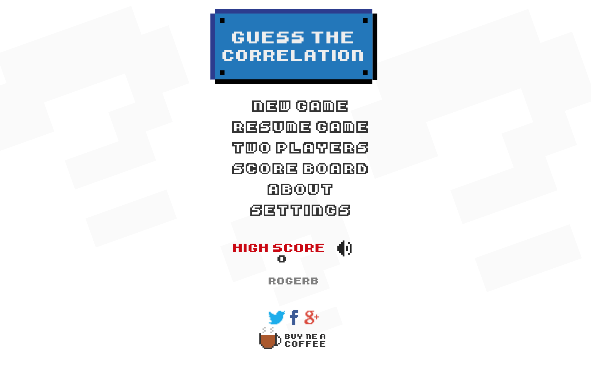
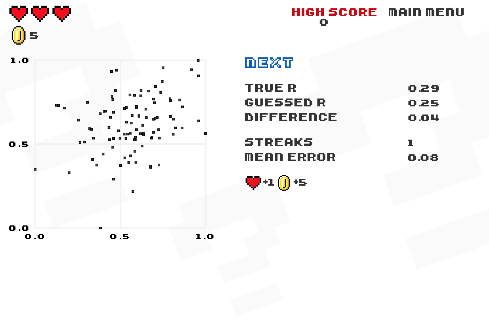

```{r setup, include=FALSE, echo=FALSE}
options(htmltools.dir.version = FALSE)
knitr::opts_chunk$set(comment = "")
library(tidyverse)
library(here)
library(knitr)
library(kableExtra)
```

???

Objectives | Datasets -- Contituency-level Leave voting

<!-- ## Conceptual Element

.small-font[
1. Recognise the **characteristics of effective data graphics**.

2. Understand that there is a **grammar of graphics**, and that this grammar underpins modern **visualization toolkits**.

3. Be aware of the **vocabulary** used by these toolkits -- that of **encoding data through visual channels**.

4. Be able to **select appropriate visual channels** given a data item’s measurement type.

5. Appreciate how visual channels and evidence of their encoding effectiveness can be used to **evaluate data graphics**.
] -->


---

## Introducing Fundamentals

<div class="embed-responsive embed-responsive-16by9">
<iframe class="embed-responsive-item" src="https://www.youtube.com/embed/Sua0xDCf8MA" frameborder="0" allow="accelerometer; autoplay; encrypted-media; gyroscope; picture-in-picture" allowfullscreen></iframe>
</div>

???

Fundamenrals :
* position on what vis is and should do
* processes of creating and evaluating data graphics
* vocabulary for this
* using 2019 General Election
---

## Characteristics of effective data graphics

???

Data vis is a varied field but effective data graphics have ...
--
.tiny-font[
* Represent **complex datasets** graphically to **expose structure, connections and comparisons** that could not be achieved easily via other means.
]

--
.tiny-font[
* Are data rich: present **many numbers in a small space**.
]

--

.tiny-font[
* Reveal **patterns** at **several levels of detail**: from broad overview to fine structure.
]

--

.tiny-font[
* Have elegance : emphasise dimensions of a dataset **without extraneous detail**.
]

--
.tiny-font[
* Generate an **aesthetic response** that encourages people to **engage** with the data or question.
]

---

## Characteristics of effective data graphics

.tiny-font[
> Data graphics visually display measured quantities by means of the **combined use of points, lines, a coordinate system, numbers, symbols, words, shading, and color**.
>
> Tufte 1983
]
--
<br>

.xtiny-font[
```{r wp-map, echo=FALSE, fig.cap="Maps of 2016 US presidential election results. Left - two-colour choropleth in Medium. Right - information-rich data graphic in The Washington Post.", out.width="70%"}
knitr::include_graphics("../class/03-class_files/trump_maps.png", error = FALSE)
```
]

???

Data vis is a careful thinking through of data you have -- its type -- how it ican be represented using the visual system -- and to support particular analysis tasks.

Data - Visuals -- Tasks

---

## Grammar of Graphics

--
.xtiny-font[
```{r gog, echo=FALSE, fig.cap="Components of Wickham 2010's Layered Grammar of Graphics.", fig.align="left", out.width="50%"}
include_graphics("../class/03-class_files/gog.png", error = FALSE)
```
]

???
Already you will notice that I am describing graphics in a consistent way.

There are advantages of doing this.

GoG -- written byWilkinson in late 1990s -- captures process of turning data into visuals.

Graphics have this underlying structure -- levels.
---

## Grammar of Graphics

.xtiny-font[
```{r gog-demo, echo=FALSE, fig.cap="Plots, grammars and associated ggplot2 specifications for the scatterplot.", out.width="50%"}
include_graphics("../class/03-class_files/gog-demo.png", error = FALSE)
```
]

---

## Grammar of Graphics

.xtiny-font[
```{r gog-demo-1, echo=FALSE, fig.cap="Plots, grammars and associated ggplot2 specifications for the scatterplot.", out.width="70%"}
include_graphics("../class/03-class_files/gog-demo-1.png", error = FALSE)
```
]

---

## Grammar of Graphics

.xtiny-font[
```{r gog-demo-2, echo=FALSE, fig.cap="Plots, grammars and associated ggplot2 specifications for the scatterplot.", out.width="70%"}
include_graphics("../class/03-class_files/gog-demo-2.png", error = FALSE)
```
]

---

## Grammar of Graphics

.xtiny-font[
```{r gog-demo-3, echo=FALSE, fig.cap="Plots, grammars and associated ggplot2 specifications for the scatterplot.", out.width="70%"}
include_graphics("../class/03-class_files/gog-demo-3.png", error = FALSE)
```
]

---


## Marks and visual channels

.tiny-font[
> Effective data visualization design is concerned with representing data through **marks** and **visual channels** in a way that best conveys the properties of the data that are to be depicted.
>
> via Jo Wood
]

???

Marks > geom
Channels > aes
Tableau and vega-lite
Munzner

---
## Marks and visual channels
.xtiny-font[
```{r munzner, echo=FALSE, fig.cap="Visual channels to which data items can be encoded, as they appear in Munzner 2014.", out.width="60%"}
include_graphics("../class/03-class_files/munzner.png", error = FALSE)
```
]

???

Two categories > data type
Some more effective than others
---

## Upstream evaluate

.xtiny-font[
```{r wp-map-revisit, echo=FALSE, fig.cap="Maps of 2016 US presidential election results. Left - two-colour choropleth in Medium. Right - information-rich data graphic in The Washington Post.", out.width="75%"}
knitr::include_graphics("../class/03-class_files/trump_maps.png", error = FALSE)
```
]

???
We can use this to evaluate designs on their encoding effectiveness
Table 2 of notes
Also mention symbilisation

---

## Checking perceptual rankings: preattentive processing

```{r no-encoding, echo=FALSE, out.width="30%"}
knitr::include_graphics("../class/03-class_files/no-encoding.png", error = FALSE)
```

```{r area-encoding, echo=FALSE, out.width="30%"}
knitr::include_graphics("../class/03-class_files/area-encoding.png", error = FALSE)
```

```{r angle-encoding, echo=FALSE, out.width="30%"}
knitr::include_graphics("../class/03-class_files/angle-encoding.png", error = FALSE)
```

```{r hue-encoding, echo=FALSE, out.width="30%"}
knitr::include_graphics("../class/03-class_files/hue-encoding.png", error = FALSE)
```
????
Notes -- different tasks

That certain of these take advantage of preattentive processing.


---

## Checking perceptual rankings: estimating quantities


.xtiny-font[
```{r perception, echo=FALSE, fig.cap="Differences in power law exponents for the perception of variation in length and area.", out.width="60%"}
knitr::include_graphics("../class/03-class_files/perception.png", error = FALSE)
```
]


---
## Perceiving statistical features


<a href="http://guessthecorrelation.com/">
</img>
</img>
</a>

<br><br><br><br><br><br><br><br><br><br><br>

.small-font[
[`http://guessthecorrelation.com/`](http://guessthecorrelation.com/)
]

???

Precision with which we can judge correlation as it increases is non-linear.

---

## Technical Element

.small-font[
1. Plot distributions

2. Plot relationships

3. Plot geography

]


---
