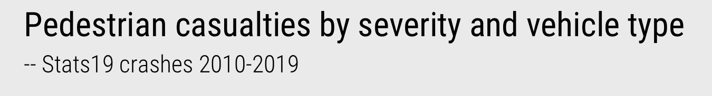
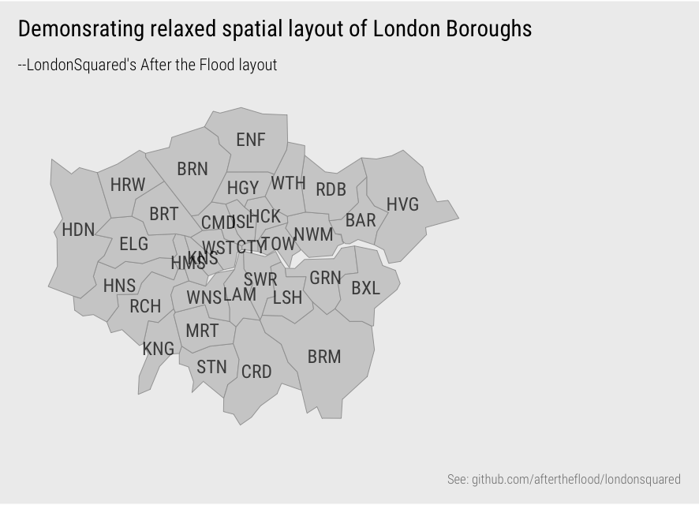

```{r setup, include=FALSE, echo=FALSE}
options(htmltools.dir.version = FALSE)
knitr::opts_chunk$set(comment = "")
library(tidyverse)
library(here)
library(knitr)
library(kableExtra)
```

???
Last session : heavy conceptual content

EDA : more practical

EDA : expose properties and structure of a dataset, and from here suggest directions for analytic inquiry. In an EDA, relationships are quickly inferred, anomalies labelled, assumptions tested and new hypotheses and ideas are formulated

Do so with Stats19 -- how detailed comparison across many categorical variables can be effected using colour, layout and statistical computation

---

## EDA and statistical graphics

.small-font[
> The simple graph has brought more information to the data analyst’s mind than any other device.
>
> John Tukay
]
---
## EDA and statistical graphics

.small-font[
Two (initial) goals that EDA should address:

1. What type of **variation** occurs **within** variables of a dataset?
2. What type of **covariation** occurs **between** variables of a dataset?
]

---

## EDA and statistical graphics

.xtiny-font[
```{r variable-types, echo=FALSE, fig.cap="Breakdown of variable types", out.width="100%"}
variable_types <- tibble::tibble(
  Measurement = c("Nominal", "Ordinal", "Continuous", "Nominal", "Ordinal", "Continuous"),
    Statistics = c(
      "mode &#124 entropy",
      "median &#124 percentile",
      "mean &#124 variance",
      "contingency tables",
      "rank correlation",
      "correlation"
      ),
     "Chart idiom" = c(
       "bar charts, dot plots ...",
       "bar charts, dot plots ...",
       "histograms, box plots, density plots ...",
       "mosaic/spine plots ...",
       "slope/bump charts ...",
       "scatterplots, parallel coordinate plots ..."
       )
)

kbl(variable_types,  caption = "", protect_latex = TRUE, escape=FALSE) %>%
 pack_rows("Within-variable variation", 1, 3, bold=FALSE, label_row_css = "border-bottom: 0px solid;") %>%
 pack_rows("Between-variable variation", 4, 6, bold=FALSE, label_row_css = "border-bottom: 0px solid;") %>%
 column_spec(1, width = "8em")
```
]

???

---

## Variation within continuous variables

```{r univariate-continuous, echo=FALSE, fig.cap="", fig.align="left", out.width="60%"}
include_graphics("../class/04-class_files/univariate-plots.png", error = FALSE)
```

???

 *strip-plot* :  x-position, with transparency and a random vertical perturbation applied to resolve occlusion Scale poorly, but all observations are displayed without the need to impose an aggregation. Location of the distribution – denser dots towards 20-25 age range – but also that there is quite a degree of spread across the age values.

*Histograms* partition continuous variables into equal-range bins. Bin counts are encoded on an aligned scale using bar height. Increasing the size of the bins increases the resolution of the graphical summary. Histograms give distributions a “shape” that is expressive. It is easy to identify the location of a distribution and, in using length on aligned scale to encode frequency, estimate relative densities between different parts of the distribution. Different from the strip-plot, the histogram allows us to intuit that despite the heavy spread, the distribution of casualty_age is right-skewed, and we’d expect this given the location of the mean (36 years) relative to the median (33 years).

 artificial edge-effects around the bins. Density plots overcome this -- smoothed histograms. Kernel density estimation (KDE) to show the probability density function of a variable – the relative amount of probability attached to each value of casualty_age. Overall “shape” to the distribution can be immediately derived. It is also possible to infer statistical properties: the mode of the distribution (the highest density), the mean (by visual averaging) and median (finding the midpoint of the area under the curve). Density plots are better suited to datasets that contain a reasonably large number of observations and due to the smoothing function it is possible to generate a density plot that suggests nonsensical values (e.g. negative ages in this case if I hadn’t censored the plot range).

Boxplots encode the statistical properties directly.

---

## Variation within continuous variables

```{r boxplots-class, echo=FALSE, fig.cap="", fig.align="left", out.width="60%"}
include_graphics("../class/04-class_files/boxplot-by-class.png", error = FALSE)
```

---

## Variation within and between categorical variables

</img>

</img>

???

Are crashes involving certain vehicle associated with more/less severe injury than others?

---

## Variation within and between categorical variables

</img>

</img>

--

</img>

--

</img>


---

## EDA workflow

.small-font[
1. Expose pattern
2. Model an expectation derived from pattern
3. Show deviation from expectation

]

--

.pull-left[.small-font[
> Expectation:
>
> Casualty severity does not vary depending on vehicle type
]]

--

.pull-right[.xtiny-font[
```{r tab-vehicle-severity-resids, echo=FALSE, message=FALSE, out.width="100%"}
readr::read_csv(here::here("static","csv","vehicle_severity_cross_resids.csv")) %>%
  kbl(caption = "") %>%
  row_spec(9, bold=T) %>% column_spec(4,bold = T) %>%
  add_header_above(c(" ", "Observed" = 3, "Expected" = 2, "Signed chi-scores"=2))
```
]]
---

## EDA workflow


</img>

</img>

--
 </img>

--

 </img>

--

 </img>

???
Emphasise flexibility

---

## Comparison: juxtaposition | superimposition | direct encoding

???

Back to notes

---

## Comparison: juxtaposition

```{r mosaic-harrow-westminster, echo=FALSE, fig.cap="", fig.align="left", out.width="70%"}
include_graphics("../class/04-class_files/mosaic_harrow_westminster.png", error = FALSE)
```

---


## Comparison: juxtaposition

</img>

</img>

---

## Comparison: juxtaposition

</img>

</img>

---

## Comparison: juxtaposition

</img>

---

## Comparison: juxtaposition

</img>
