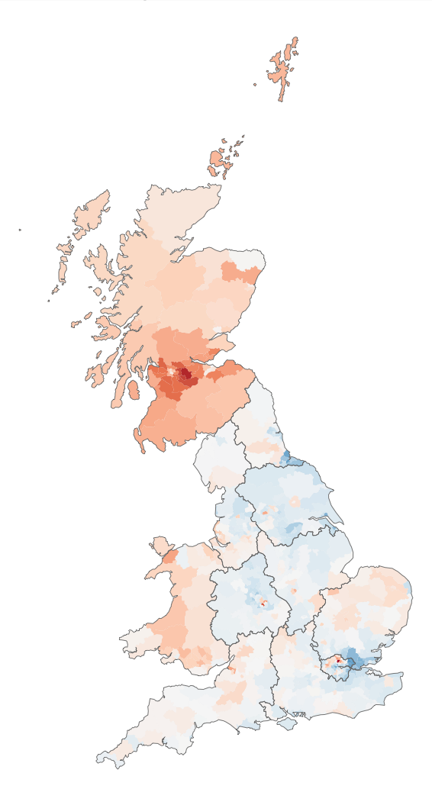
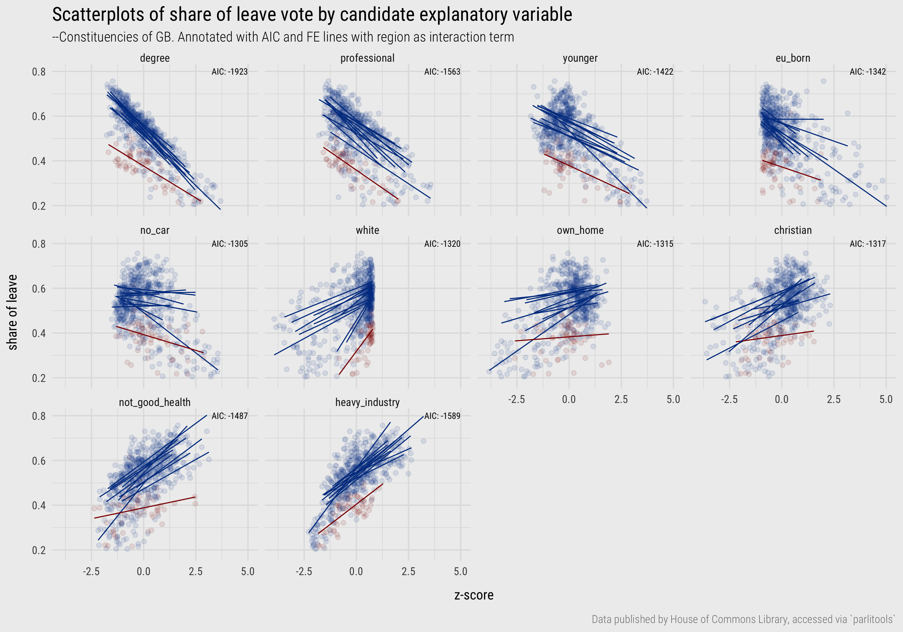
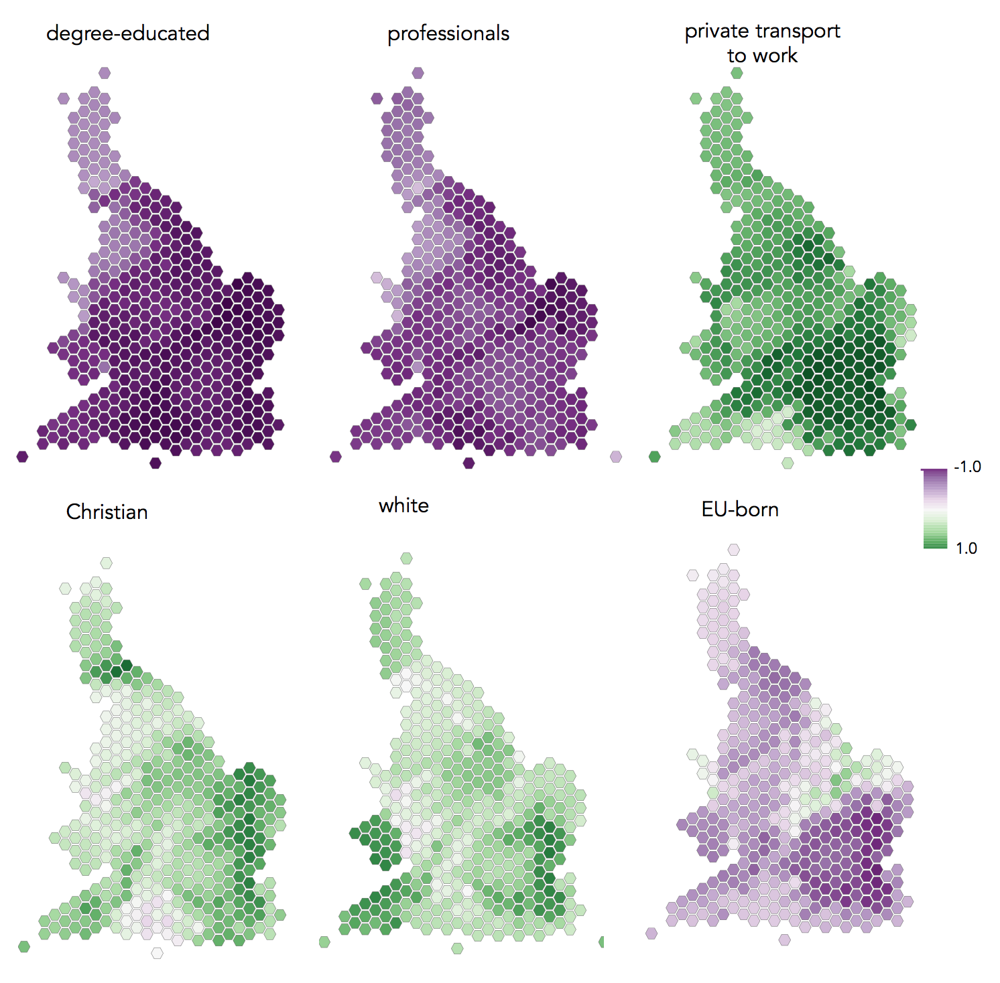

```{r setup, include=FALSE, echo=FALSE}
options(htmltools.dir.version = FALSE)
knitr::opts_chunk$set(comment = "")
library(tidyverse)
library(here)
library(knitr)
library(kableExtra)
```


## Exploring bias

</img>

???

Geographic patterning in residuals is common – and expected – in area-level analysis, but is problematic as it indicates bias – that Leave voting is better represented in certain areas than in others because the model ignores some systematic grouping context.

---

## Exploring bias

--
1. Spatial dependence in **variable values**

--
2. Spatial non-stationarity in **processes**


???

1. The geography of GB is quite socially distinctive, so it is reasonable to expect spatial dependence in observed demographic values.
For example, the range in variables measuring relative employment in heavy industry, or residents that are white, is likely to be bounded to economic regions and metropolitan-peripheral regional contexts.

2. This is where associations between variables might be geographically grouped: that the associations vary for different parts of the country and so there is heterogeneity in process. For example, high levels of EU-born migration might affect political attitudes, and thus area-level voting, differently in different parts of the country.


--

.pull-left[
**Geographic context**
* space (continuous)
* place (categorical)
]

.pull-right[
</img>
]

???

Space as a continuous process / entity
Place as a categorical entity

---

## Fixed Effects adjustment: geography as nuisance term

\begin{align*}
       y_{i}&= \gamma_{j}  + \beta_{1}x_{i1} + \varepsilon_{i}  \\
\end{align*}

<br>
.small-font[
* $\gamma_{j}$, a constant term similar to an intercept for region $j$, $+$
* $\beta_{1}=\beta_{1}x_{i1}$, the slope, indicating in which direction and to what extent some explanatory variable measured at constituency $i$ is associated with Leave,  $+$
* $\varepsilon_{i}$, the difference between $y_{i}$ (the observed value) at constituency $i$ and the *unobservable* true population value of the Leave vote in that constituency (statistical error)
]
???

* dummy variable created for each group (region in our case), and every region receives a constant
* like a separate intercept for its regression line
* any group-level sources of variation in the outcome are collapsed into the FE variable
* regression coefficients are not complicated by this more messy variation – they now capture the association between demographics and Leave after adjusting for systematic differences in the Leave vote due to region.
* and allow us to quantify the effect of region after dmographics


---

## Fixed Effects adjustment: geography as nuisance term

</img>


---

## Fixed Effects adjustment: geography as nuisance term

</img>

???

FE coefficients -- interesting properties: estimated size of the Leave vote for a constituency in a region net of demographic composition.

London -- constituencies in Scotland and London were originally distinctive in voting in much smaller proportions than the rest of the country for Leave.

Given the associations  with Leave  and demographic composition, however, if we were to randomly sample two constituencies that contain the same demographic characteristics, one in London and one in another region (say North West), on average we’d expect Leave for the constituency in London to be higher (~60%) than that sampled from North West (~51%).

 Scotland would have a lower Leave vote (~38%) – that is, net of demographics there is some additional context in Scotland that means Leave is lower than in other regions.

coefficients are estimated with less uncertainty (tighter standard errors).

Previous session, the white counterintuitively negative association with Leave (although there was high uncertainty here). Now conforms to expectation.
---

## Interaction term: modelling for geographic process

\begin{align*}
       y_{i}&= \gamma_{j}  + \beta_{1j}x_{i1} + \varepsilon_{i}  \\
\end{align*}

<br>
.small-font[
* $\gamma_{j}$, a constant term similar to an intercept for region $j$, $+$
* $\beta_{1j}x_{i1}$, the region-specific slope, indicating in which direction and to what extent some demographic variable at constituency $i$ and in region $j$ is associated with Leave,  $+$
* $\varepsilon_{i}$, the difference between $y_{i}$ (the observed value) at constituency $i$ and the *unobservable* true 'population' value of the Leave vote in that constituency (statistical error)
]


---

## Interaction term: modelling for geographic process

</img>


???

* parallel slopes with large variation in vertical position suggest that there is variation in the outcome (Leave) between regions, but a consistent association between variables exists;
* substantial changes in slope (cluttered display) suggests that the pattern of association switches between regions.
* Most obvious here is the EU-born and no-car variable.

---

## Interaction term: modelling for geographic process


</img>

???

* degree-educated has a negative coefficient and with reasonably tight uncertainty estimates, or at least CIs that do not cross 0.
*  other variables are subject to more uncertainty.
*  no-car variable is also negatively associated with Leave, a variable we thought may separate metropolitan versus peripheral contexts, but the strength of negative association, after controlling for variation in other demographic factors, does vary by region.
*   heavy industry variable, previously identified as being strongly associated with Leave (e.g. previous session), has a clear positive association only for London and to a much lesser extent for North West and Wales (small coefficients).
*   EU born variable is again the least consistent as it flips between positive and negative association when analysed at the regional-level: after controlling for variation in other demographic characteristics it is positively associated with Leave for North West, Scotland, South West, but negatively associated with Leave for the North East (though with coefficients that are subject to much variation).

---

## Geographic context as continuous effect

</img>

---
