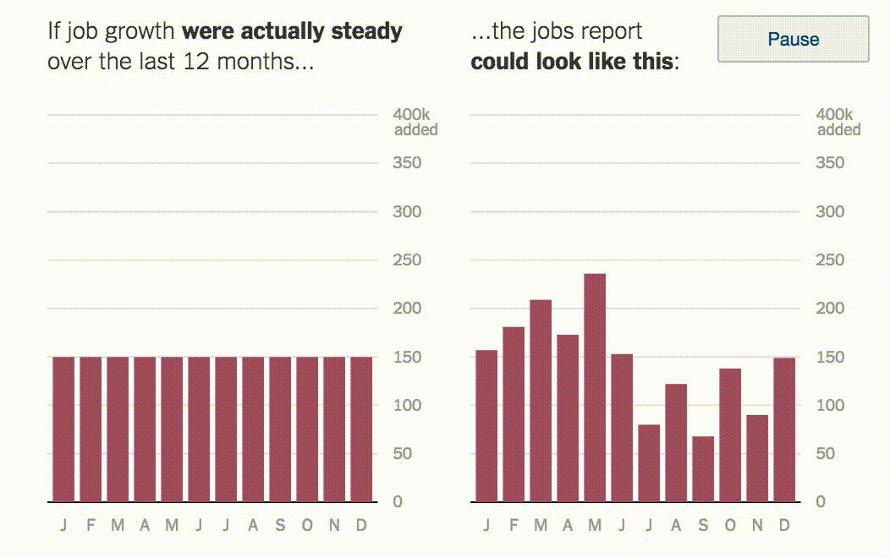

```{r setup, include=FALSE, echo=FALSE}
options(htmltools.dir.version = FALSE)
knitr::opts_chunk$set(comment = "")
library(tidyverse)
library(here)
library(knitr)
library(kableExtra)
```

???

* Core to data analysis
* Many ways in which it can be understood and represented
* This session -- parameter uncertainty -- representing the different possible values that a parameter might take
* Using visualization to imply levels of uncertainty
* Doing so in a reliable way is challenging

---

## Visual variables / channels for uncertainty

</img>


???

Vis research concerned with visual variables / visual channels used to represent uncertainty.
Ideally:
* intuitive -- related to precision/accuracy
* discriminative -- levels can be discriminated
* exmaples : fuzziness -- effective (semantically related)
* size/transparency/colour values -- though less logically related to uncertainty
* * sketchiness


---
## Uncertainty visualization

--

.small-font[
> *Things that are not precise should not be encoded with symbols that look precise*
]
???

Key mantra/guideline for uncertainty vis

---

## Uncertainty visualization: Cone of uncertainty


</img>


???

1. cone starts at the storm’s current location and spreads out to represent the projected path of the storm
2.  cone implies that the storm is growing as we move away from its current location
3.  Instead more uncertainty in the areas that could be affected by the storm the further away those areas are from the storm’s current location.
4.  Cone uses strong lines that imply precision: temptation to think anything contained by the cone is unsafe and anything outside of it is safe.
5.  Areas beyond the cone fall outside some chosen threshold probability.
6. Redesign : four binned categories of storm probability suggested by the model
7. Redesign : curve schematisation (see Van Goethem et al. 2014) to symbolise states using a single line. This provides context but in a way that may discourage binary thinking; precise inferences of location are not possible as the area and state borders are very obviously not exact


---

## Parameter uncertainty: frequency framing

--

</img>

???
* parameter uncertainty: estimated injury severity rates for pedestrian-vehicle crashes in our STATS19 road crash dataset.
* relative frequencies, risk ratios -- notoriously difficult to generate inuition on these
* KSI rate of ped-vehicle crashes comparing two areas. Bristol and Sheffield. Similarly sozed but different KSIs -- 15% Bristol; 50% Sheffield
* Icon arrays -- effective at communicating probabolities of event outcomes -- alternative might be to show lenght in bars. But the random element of arrangement helps intuition around probabilities

---
## Parameter uncertainty: frequency framing

</img>

---

## Quantifying parameter uncertainty: bootstrapping

</img>


???

* comparing single parameter values
* but problem with ratios is they are insensitive to sample size -- in notes we compare two other areas that contain radically different rates but based on small numbers
* We can derive a range of possible values that a parameter might take.
* Do this by generating empirically a sampling distribution.

---

## Visualizing uncertaity in frequencies


</img>

</img>

</img>


???

https://www.nytimes.com/2014/05/02/upshot/how-not-to-be-misled-by-the-jobs-report.html
