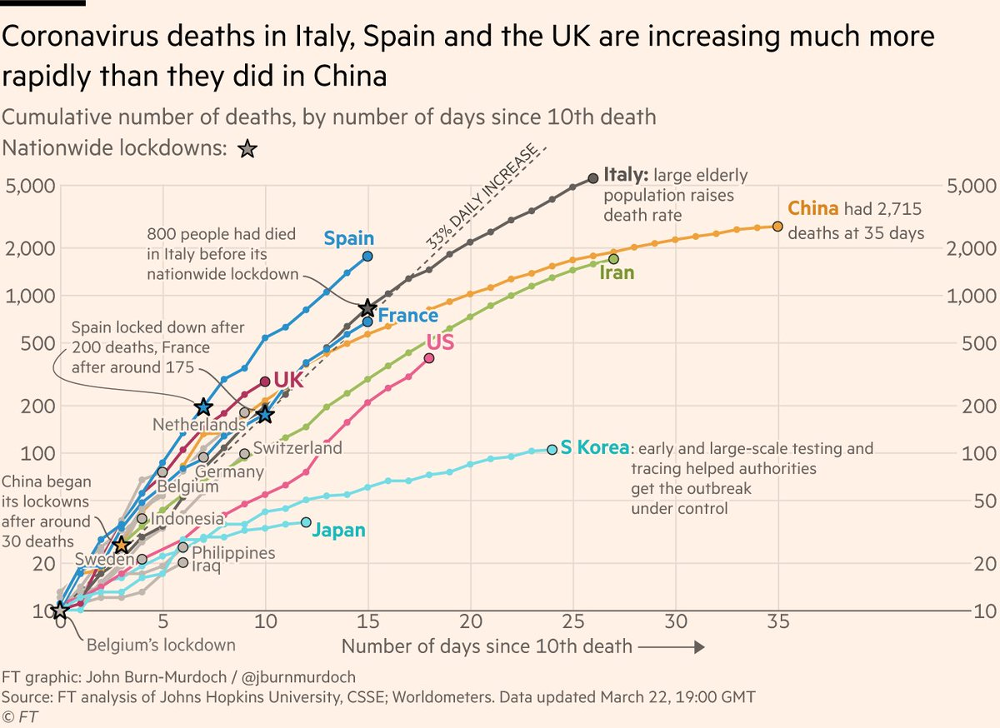
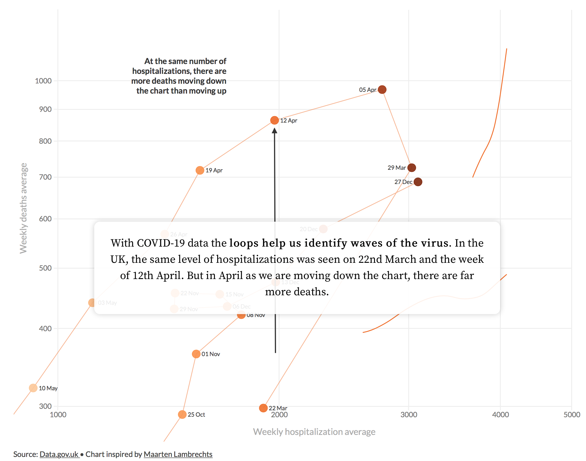
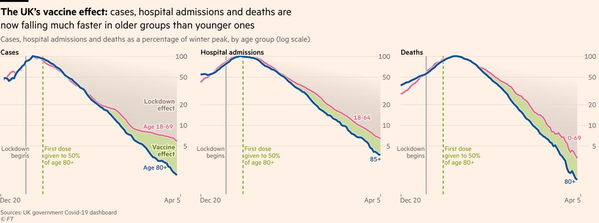

```{r setup, include=FALSE, echo=FALSE}
options(htmltools.dir.version = FALSE)
knitr::opts_chunk$set(comment = "")
library(tidyverse)
library(here)
library(knitr)
library(kableExtra)
```

???
* Evidence-based society
* Open Science -- massively freed up rocess of working with data
* Pandemic example -- Exciting, but responsibility on communicating with integrity, reliably and effectively
* Recently InfoVis much concerned with data storytelling -- so too popular science.
* In this session ...

---

## Characteristics of data-driven stories

???

Think differently about data vis and analysis than previously in this course where more of a formulation approach.
--
Roth (2020):

--

.small-font[
* **Designed**: The analyst makes very deliberate decisions in light of audience and purpose.
]

--

.small-font[
* **Partial**: Essential information is prioritised and made salient, with abstraction and brevity preferred over complexity and completeness.
]

--

.small-font[
* **Intuitive**: Visual narratives take advantage of our natural tendency to communicate via metaphor and story, with a clear "entry point" and clear progression.
]

--

.small-font[
* **Compelling**: Visual stories often capture attention through an array of graphical devices -- sequence, animation and interaction. They generate an aesthetic response.
]

--

.small-font[
* **Relatable and situated**: Visual stories promote empathy, using devices that place the audience in the story setting.
]

--

.small-font[
* **Political**: Visual data stories often promote with clarity particular voices, interpretations or positions.
]

???

---
## Designed and partial

</img>


---


## Intuitive and compelling

</img>


---

## Political

</img>
