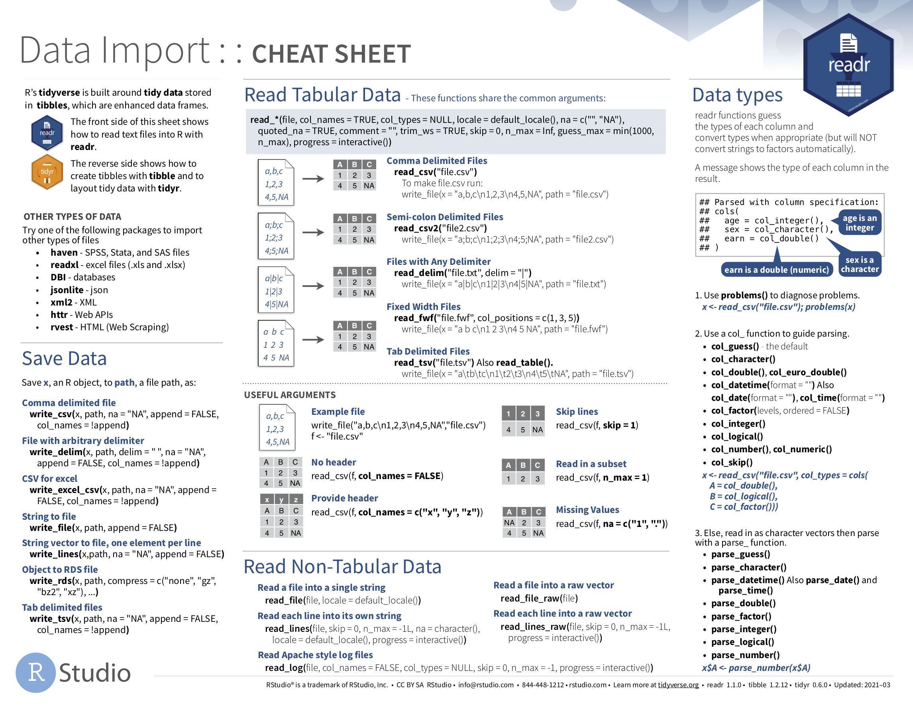
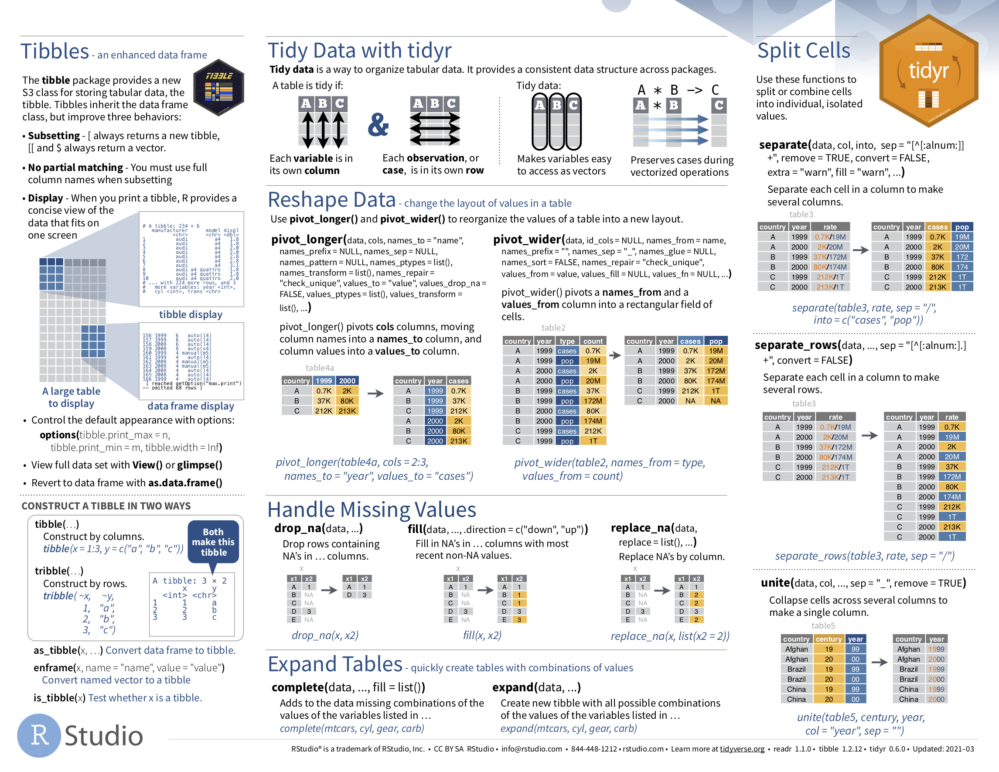

```{r setup, include=FALSE, echo=FALSE}
options(htmltools.dir.version = FALSE)
knitr::opts_chunk$set(comment = "")
library(tidyverse)
library(here)
library(knitr)
library(kableExtra)
```

## Conceptual Element

.small-font[
1. The vocabulary used to describe data

2. Tidy Data (Wickham 2014) -- its characteristics and importance for SDS
]


---


## Data Fundamentals


<a href="www.rstudio.com/resources/cheatsheets/">
</img>
</img>
</a>

<br><br><br><br><br><br><br><br><br><br><br><br><br>

.small-font[
[`www.rstudio.com/resources/cheatsheets/`](https://www.rstudio.com/resources/cheatsheets/)
]
---

## Data Fundamentals


</img>

---


## Data Fundamentals


</img>

---

## Stevens levels of measurement

.xtiny-font[
```{r variable-types, echo=FALSE, fig.cap="Breakdown of variable types", out.width="100%"}
variable_types <- tibble::tibble(
  Measurement = c("`Nominal`", "`Ordinal`", "`Quantitative`", "`Temporal`", "`Geospatial`"),
  Description = c(
    "Categories that cannot be ordered",
    "Categories that can be ordered",
    "Numeric measurements and counts",
    "Measures related to time",
    "Geographic locations and features"
  ),
  Example = c(
    "Names of people;  countries; political parties",
    "Small, Medium, Large; 1st, 2nd, 3rd",
    "Distances; prices; temperatures; frequencies",
    "Dates; times",
    "Long/Lat, Easting/Northing; region/country geometries"
    )
)


variable_types <- tibble::tibble(
  Measurement = c("Nominal", "Ordinal", "Interval", "Ratio"),
  Description = c(
    "Non-orderable categories",
    "Orderable categories",
    "Numeric measurements",
    "... &#124 Counts"
  ),
  Example = c(
    "Political parties; street names",
    "Terrorism threat levels",
    "Temperatures; years",
    "Distances; prices "
    ),
  Operators = c(
    "&#61;  &#8800;",
    "... &#124 <>",
    "... &#124 +  -",
    "... &#124 &#215; &#247;"
    ),
    Midpoint = c(
      "mode",
      "... &#124 median",
      "... &#124 mean",
      "... &#124 mean"
      ),
      Dispersion = c(
        "entropy",
        "... &#124 percentile",
        "... &#124 variance",
        "... &#124 variance"
        )

)

kbl(variable_types, protect_latex = TRUE, escape=FALSE) %>%
 pack_rows("Categories", 1, 2, bold=FALSE, label_row_css = "border-bottom: 0px solid;") %>%
 pack_rows("Measures", 3, 4, bold=FALSE, label_row_css = "border-bottom: 0px solid;") %>%
 column_spec(1, width = "8em")
```
]

---


## Stevens levels of measurement

.xtiny-font[
```{r plot-dist, echo=FALSE, fig.cap="Histograms generated with ggplot2. Plot data computed using dplyr and lubridate", out.width="70%"}
include_graphics("../class/02-class_files/dist.png", error = FALSE)
```
]
???

E.g. with data graphics --


---

## Stevens levels of measurement
.xtiny-font[
```{r plot-speeds, echo=FALSE, fig.cap="Line charts generated with ggplot`. Plot data computed using dplyr and lubridate", out.width="70%"}
include_graphics("../class/02-class_files/speeds.png", error = FALSE)
```
]
???

E.g. with data graphics --


---


## Stevens levels of measurement

.xtiny-font[
```{r plot-temporal, echo=FALSE, fig.cap="Line charts generated with ggplot2. Plot data computed using dplyr and lubridate.", out.width="70%"}
include_graphics("../class/02-class_files/hod_dow.png", error = FALSE)
```
]
???

E.g. with data graphics -- for example in this session. Summarise distribution on quantitative variable (time of day). Though this is a cyclic variable so hour of day necessary

---

## Stevens levels of measurement

.tiny-font[Object types in `R`:]

.xtiny-font[
```{r data-types, echo=FALSE, out.width="100%"}

data_types <- tibble::tibble(
  Type = c("lgl", "int", "dbl", "chr", "dttm", "fctr" ),
  Description = c(
    "Logical -- vectors that can contain only `TRUE` or `FALSE` values",
    "Integers -- whole numbers",
    "Double --  real numbers with decimals",
    "Character -- text strings",
    "Date-times -- a date + a time",
    "Factors -- represent categorical variables of fixed and potentially orderable values"
  )
)

kbl(data_types)
```
]

---


## Tidy data

</img>

---

## Tidy data

.xtiny-font[
```{r drugs-one, echo=FALSE, fig.cap="Untidy", out.width="50%"}
drugs <- tibble::tibble(
  person = c("John Smith", "Jane Doe", "Mary Johnson"),
  treatment_a = c("--", "16", "3"),
  treatment_b = c("2", "11", "1")
    )
kbl(drugs,  caption = "Untidy")
```
]
---
## Tidy data

.xtiny-font[
```{r drugs-two, echo=FALSE, fig.cap="Untidy", out.width="50%"}
drugs <- tibble::tibble(
  treatment = c("treatment_a", "treatment_b"),
  "John Smith" = c("--", "2"),
  "Jane Doe" = c("16", "11"),
  "Mary Johnson" = c("3", "1")
    )
kbl(drugs,  caption = "Untidy")
```
]

<br>
--

.xtiny-font[
```{r drugs-tidy, echo=FALSE, fig.cap="Tidy version of Table 1 of @wickham_tidy_2014", out.width="100%"}
drugs <- tibble::tibble(
  person = c("John Smith", "John Smith", "Jane Doe", "Jane Doe", "Mary Johnson", "Mary Johnson"),
  treatment = c("a", "b", "a", "b", "a", "b"),
  result = c("--", "2", "16", "11", "3", "1")
    )
kbl(drugs,  caption = "Tidy")
```
]

???
dentify the **variables**:

1. `person`:  a categorical nominal variable which takes three values: John Smith, Jane Doe, Mary Johnson.
2. `treatment`: a categorical nominal variable which takes values: a and b.
3. `result`: a measurement ratio (I think) variable which six recorded values (including the missing value)

Each **observation** is then a test result returned for each combination of `person` and `treatment`.

---

## Tidy data

.xtiny-font[
```{r gapminder-untidy1, echo=FALSE, fig.cap="Untidy excerpt of [`gapminder`](https://www.gapminder.org/data/) dataset.", out.width="100%"}
gapminder_untidy1 <- tibble::tibble(
  country = c("Afghanistan", "Afghanistan", "Afghanistan", "Afghanistan",  "Brazil", "Brazil", "..."),
  year = c("1999", "1999", "2000", "2000", "1999", "1999", "..."),
  type = c("cases", "population", "cases", "population", "cases", "population", "..."),
  count = c("745", "19987071", "2666", "20595360", "37737", "174504898", "...")
)
kbl(gapminder_untidy1,  caption = "Untidy")
```
]
---

## Tidy data

.xtiny-font[
```{r gapminder-untidy2, echo=FALSE, fig.cap="Untidy excerpt of [`gapminder`](https://www.gapminder.org/data/) dataset.", out.width="100%"}
gapminder_untidy2 <- tibble::tibble(
  country = c("Afghanistan", "Afghanistan", "Brazil", "Brazil", "China", "China"),
  year = c("1999", "2000", "1999", "2000", "1999", "2000"),
  f_cases = c("447", "1599", "16982", "39440", "104007", "104746"),
  m_cases = c("298", "1067", "20755", "41048", "108252", "109759"),
  f_population = c("9993400", "10296280", "86001181", "87251329", "636451250", "640212600"),
  m_population = c("9993671", "10299080", "86005181", "87253569", "636464022", "640215983")
    )
kbl(gapminder_untidy2,  caption = "Untidy")
```
]

--

.xtiny-font[
```{r gapminder-tidy, echo=FALSE, fig.cap="Tidy excerpt of [`gapminder`](https://www.gapminder.org/data/) dataset.", out.width="100%"}
gapminder_tidy <- tibble::tibble(
  country = c("Afghanistan", "Afghanistan", "Brazil", "Brazil", "China", "China"),
  year = c("1999", "2000", "1999", "2000", "1999", "2000"),
  cases = c("745", "2666", "37737", "80488", "212258", "213766"),
  population = c("19987071", "20595360", "172006362", "174504898", "1272915272", "1280428583")
    )
kbl(gapminder_tidy,  caption = "Tidy")
```
]
---

## Tidy data


</img>
</img>


---

## Tidy data


</img>

---


## Tidy data


</img>

---


## Technical Element

.small-font[
1. Load flat file datasets in RStudio

2. Calculate descriptive summaries over datasets

3. Apply high-level functions in `dplyr` and `tidyr` for transforming data

4. Create statistical graphics that expose structure in data fir cleaning purposes
]


---
