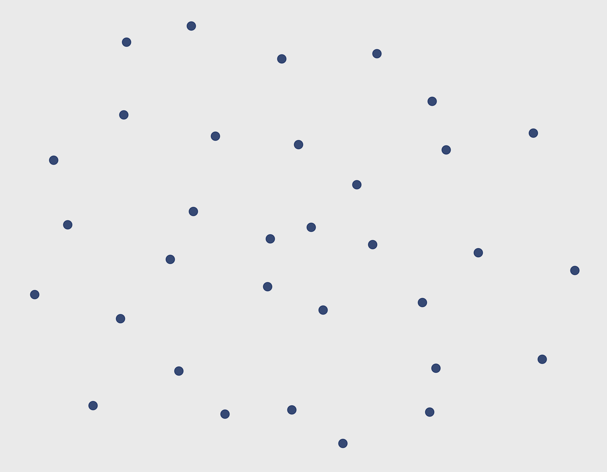
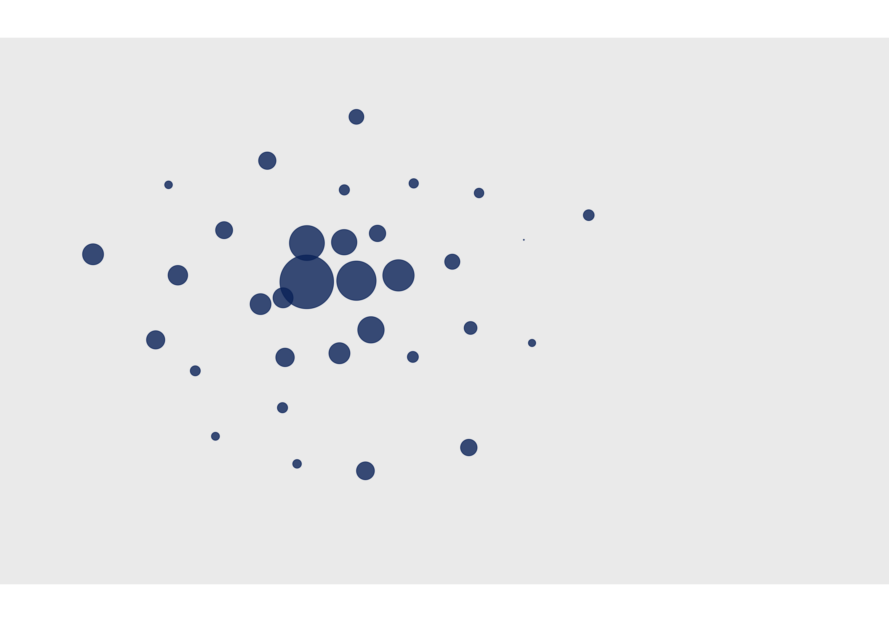
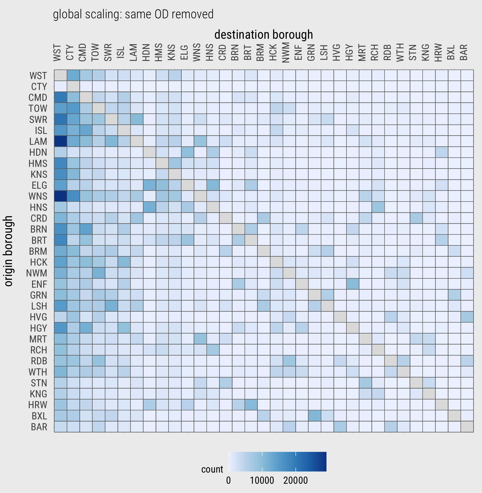
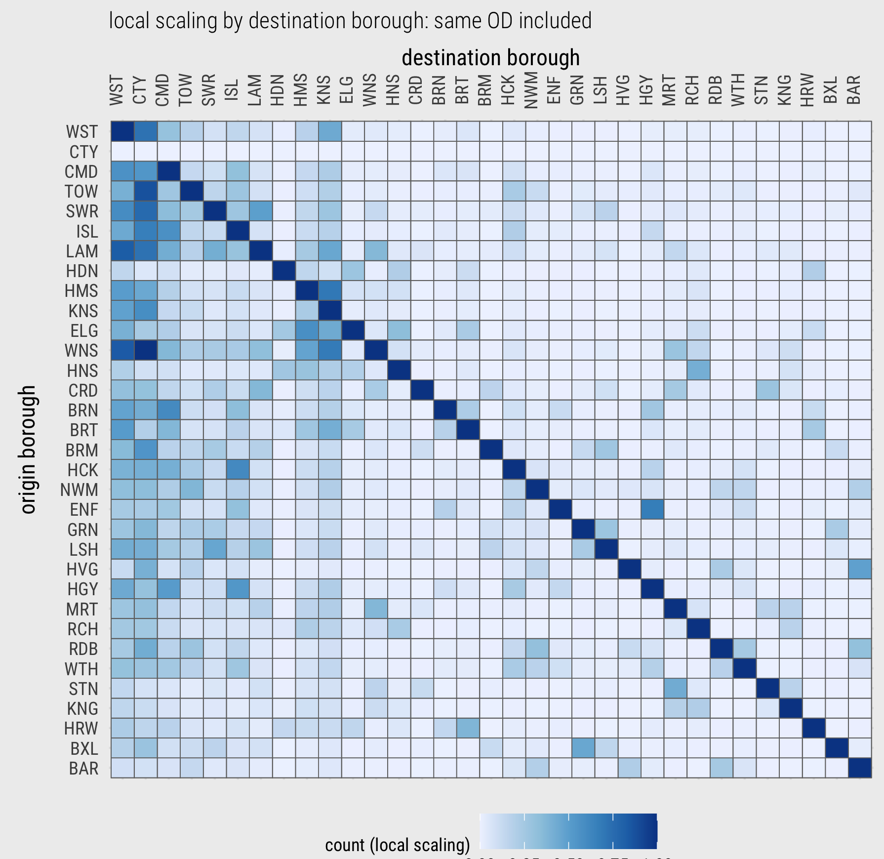
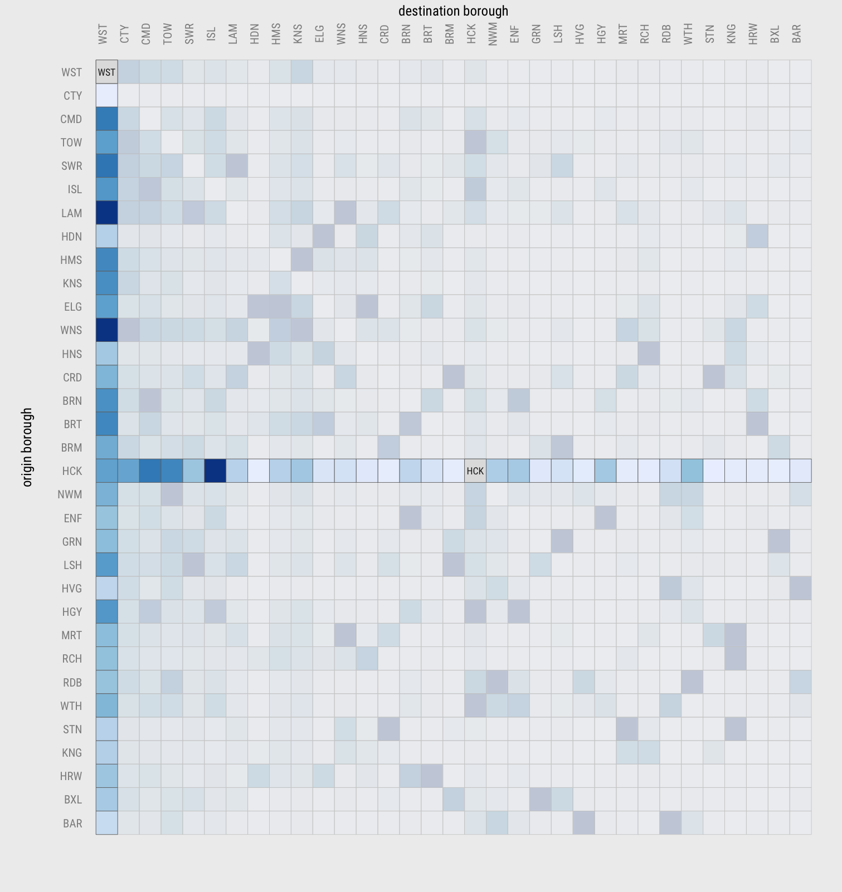
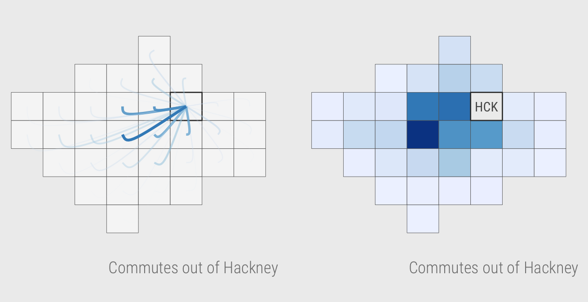
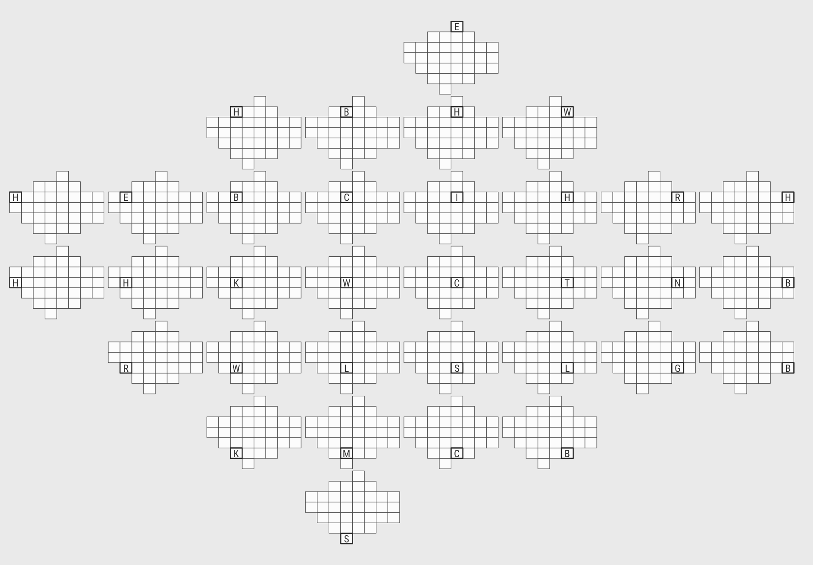
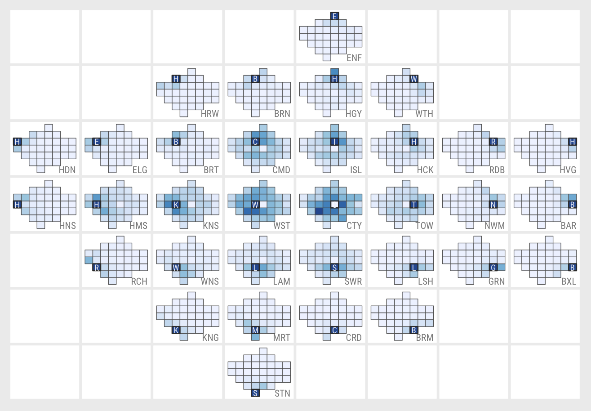

```{r setup, include=FALSE, echo=FALSE}
options(htmltools.dir.version = FALSE)
knitr::opts_chunk$set(comment = "")
library(tidyverse)
library(here)
library(knitr)
library(kableExtra)
```


## Network data : nodes

</img>

???

Special class of data used to represent things (entities) and how they relate to one another.

Nodes -- entities -- bikeshare stations, airports, authors

---


## Network data : nodes

</img>

???

Here's a layout of nodes in 2D, sized according number of connections.

---


## Network data : edges

</img>

???

* Edges -- connections -- bikeshare trips, flights, (co)authorship
* This is graph layout in two dimensions -- Nodes are positioned such that those sharing greater connection – edges with greater weights (frequencies) – are closer than those that are less well-connected – that do not share edges with such large weights. Edges are drawn as lines connecting nodes.

---

##  OD data : nodes

</img>

???
Origin-Destination network data:
* Nodes -- entities -- origin (O) and destination (D) locations -- they have an inherent 2D position


---

## OD data : nodes

</img>


---

## OD data : edges (flows)

</img>

???

* Edges -- connections -- flows linking OD locations
---

## OD data : directed edges (flows)

</img>

</img>

???

* Edges -- are directed.
* Problems with design -- layout fine, but occlusion/hairball effect.
* Salience bias of longer flows hides interesting local structure
* Can we conclude much about the geog of travel to work from this.
---


## OD data : matrix

--

</img>


???

There is some order -- ordered by frequency
---

## OD data : matrix

</img>

???

Dominant workplace boroughs ... isolated larger numbers

---


## OD data : matrix

</img>

???

Local scaling column-wise (destination-wise)

---

## OD data : matrix (spatially arranged)

</img>

--

</img>

--

</img>
---


## OD data : OD map

</img>

---

## OD data : OD map

</img>

???

Go to h-w pages

---

## OD data : OD map

</img>

---

## Example analysis
